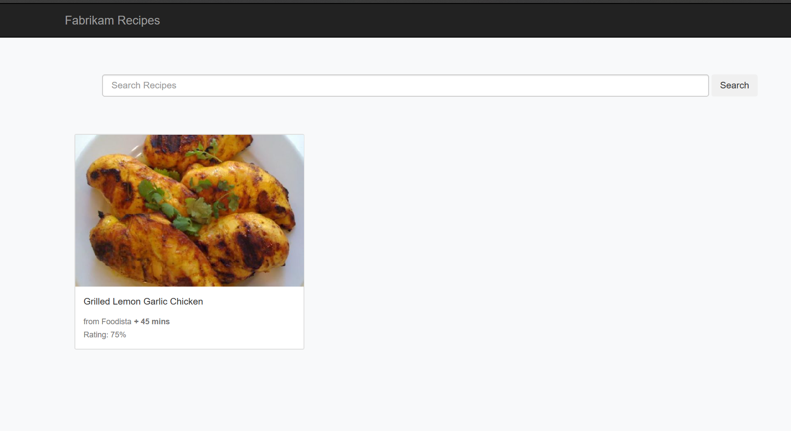

# Break On Exception
When exceptions are thrown at runtime, you are typically given a message about it in the console window and/or browser, but you would then have to set your own breakpoints to debug the issue.  However, Visual Studio also allows you to **break when an exception is thrown** automatically, regardless of whether it is being handled or not.

1.	In the application, type “Grilled Lemon Chicken” in the search box and hit the Search button.  An error message about an unhandled *NullReferenceException* should appear in the browser.  Though the message highlights a line of code in an html page, the message does not explicitly state where the null reference is located.

2.	In Visual Studio, while the app is still running, navigate to the **Exception Settings** window.  Under the **Common Language Runtime Exceptions** tab, locate and check the **System.NullReferenceException** option.

3.	Use **Ctrl+Shift+F5** or select the **Refresh** icon in the Debug toolbar to restart the app without having to stop and start the debugging environment.  

4.	Try typing “Grilled Lemon Garlic Chicken” in the application’s search box again and hit the Search button.  Visual Studio will automatically break at the point in code where the *NullReferenceError* was thrown.

  

5.	Based on the **Exception Thrown** pop-up that appears at the breakpoint, it’s revealed that the `recipes` List variable was initialized as null in the function that returns searched recipes.  At **line 51**--the location where the recipes list is first defined--change the code to the following: 

    `List<Recipe> recipes = new List<Recipe>();`

6.	Restart the application and attempt to search for “Grilled Lemon Garlic Chicken” once more.  The search should be successful now that the `recipes` list has been initialized correctly.

