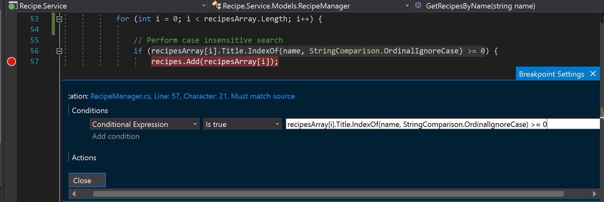
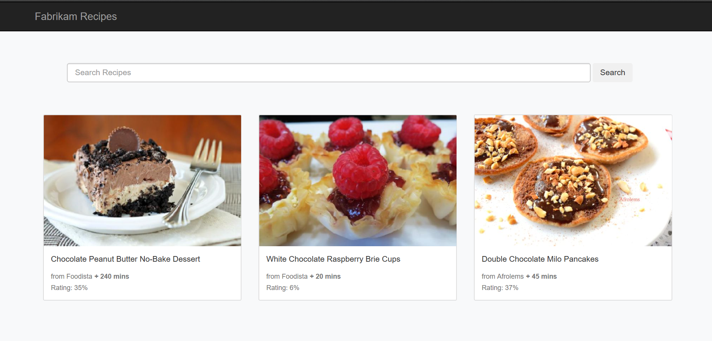

# Conditional Breakpoints
**Conditional breakpoints** allow you to break if a specified logic condition is satisfied.  In the application, the recipes are supposed to be sorted from the highest to lowest ratings but this is not the case.  To debug this issue, conditional breakpoints can be used to notify you when a swap between two recipes occurs in our search/sort function.

1.	In the **Recipe.Service** project, navigate to the **GetRecipesByName()** function in **Controllers/RecipesController.cs** file.

2.	Set a breakpoint at **line 57**.

3.	Hover over the breakpoint and select the **Settings** gear icon that appears. 

4.	Check the **Conditions** option.  Make sure the first dropdown is set to **Conditional Statement**, the second dropdown is set to "is true" and enter the following in the textbox:

    `recipesArray[i].Title.IndexOf(name, StringComparison.OrdinalIgnoreCase) >= 0`

Performing this step means that a break will occur when the above conditional statement is true, such that a recipe contains the user-specified substring in its name, thus adding the recipe as a search result.

5.	Restart the application if you are still in debug mode or start it normally.  In the search box, enter “chocolate” and run the search.  In Visual Studio, a break should have occurred at the location where you created the breakpoint after clicking the search button because a match has been found.
6.	Hit the **Continue** button twice in the Debug toolbar and a break at the same location should occur two more times before all three found matches are displayed in the application.

