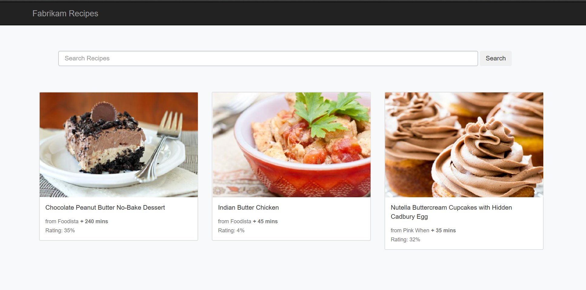

# Run To Cursor
While there are the usual breakpoints and stepping mechanics to move from one line of code to the next, these options require setting temporary breakpoints or multiple steps to execute your code or stop to the line you want.  Using **Run to Cursor**, a hidden breakpoint can be made at the location of your cursor, starting the debugger automatically and stopping at the selected line without the need of step-by-step debugging.

1.	In the **Recipe.Service** project, navigate to the **GetRecipesByName()** function in the **Models/RecipeManager.cs** file.

2.	Set a breakpoint at **line 49** and run the application.

3.	In the recipe application’s search box, enter **“butter”**. Execute the search.

4.	In Visual Studio, right click on **line 51** and select the **“Run to Cursor”** option in the context menu that appears.

5.	Hover over the recipes array in **line 51** and check that it’s null in the DataTip.

6.	A keyboard shortcut can also be used to execute a Run to Cursor.  To skip over the for loop, click anywhere on **line 61** (end of search function bracket) and hit **Ctrl + F10**.

7.	Hover over the recipes array at **line 60** to view its DataTip and check that the size is 3, the corresponding number of matching recipes found in the application containing “butter” in their names.

