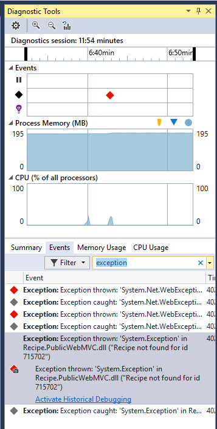
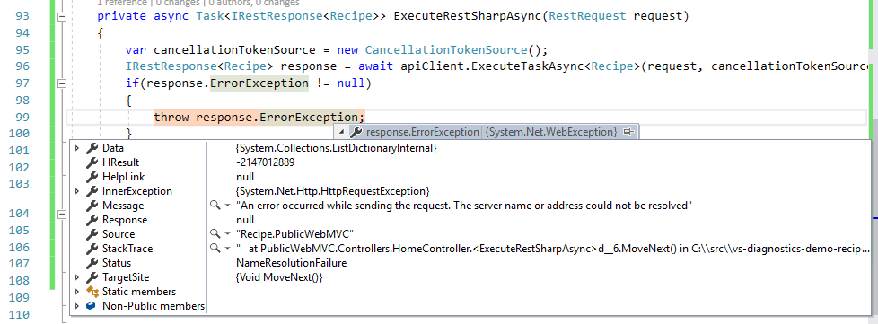
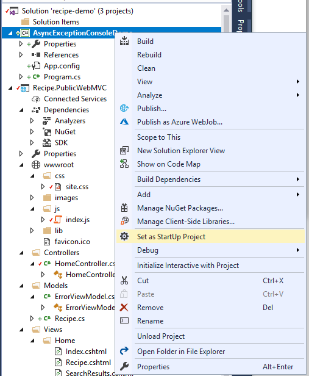
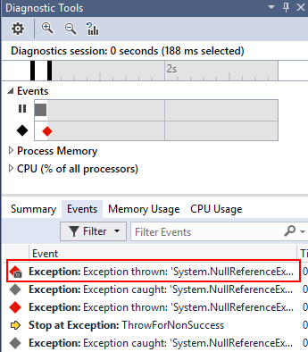

## Snapshots on Exceptions
The **Snapshots on Exceptions** feature of IntelliTrace takes snapshots of your application when an exception occurs. You can then use the **Diagnostic Tools** window to inspect that exception and the entire state of your application when the exception occurred.

### Prerequisites
1. To enable Snapshots on Exceptions follow the steps on [Enabling Snapshots](EnableSnapshots.md).
2. Enable debugging only for **Recipe.PublicWebMVC**  using the [Multiple Startup Projects Dialog](MultipleStartupProjects.md).

### Example - Exceptions

1. Start debugging (`F5`).
2. Navigate the browser to `http://localhost:61906/`.
3. Choose a recipe and click on it to navigate to it's details page (e.g. `http://localhost:61906/home/recipe/715702`). You should get an error page but not stop in the debugger.
4. Go to Visual Studio and open the **Diagnostic Tools Window** (it should already be open on the right hand side).
5. Go to the **Events** tab. 
6. In the **Filter Events** box type **"exception"** to filter the list down to just the exceptions.
7. Select the **Exception** event with the **snapshot** icon as displayed below(). This indicates that a snapshot was taken for this exception.

8. Double-click on the event or click on **Activate Historical Debugging** link.
9. Visual Studio is now debugging the exception that caused the `View` to fail to render!  

## Example - Async Exceptions
The snapshot feature is really powerful when debugging code that is using `await` or other async patterns. One of the challenges with `async` code is that an exception that has occurred previously might be responsible for an exception that you are currently debugging. Since the code is `async`, the app being debugged has moved on and none of the state from that previous point in time exists, so you can't inspect. This is where snapshots on exceptions really comes into it's own.

1. Follow the steps in the example above.
2. Looking at the exception, it doesn't really tell us anything useful. Clearly `recipe` is `null` but the question is, why? Something earlier returned `null` and but because it was an `async` `Task`, it can't be inspected from this location.

3. In the **Diagnostic Tools Window** activate the first, oldest, exception (there should be 3) and look at the code. As you can see, this is the source of the problem, the hostname for the API endpoint is incorrect.

4. To fix this issue, in the **Controllers/HomeController.cs** file, change `badhost`to `localhost` at **line 73**.

5. Run the application and click on any recipe.  It should correctly send you to the recipe's detail page.

## Example = Async Exceptions (Simplified)

1. Set the project **AsyncExceptionConsoleDemo** as the *only* startup project (i.e. set the **AsyncExceptionConsoleDemo** project to "Start" other two projects to "None").

2. Start debugging **(F5)**.
3. Visual Studio will stop on the exception on **line 25**.

4. In the **Diagnostic Tools Window**, select the first exception.

5. Double-click on the event or click on **Activate Historical Debugging** link.
6. Inspect `p` and note it's `null`. This is the source of the problem and where a null check is needed to fix the 'bug'.

